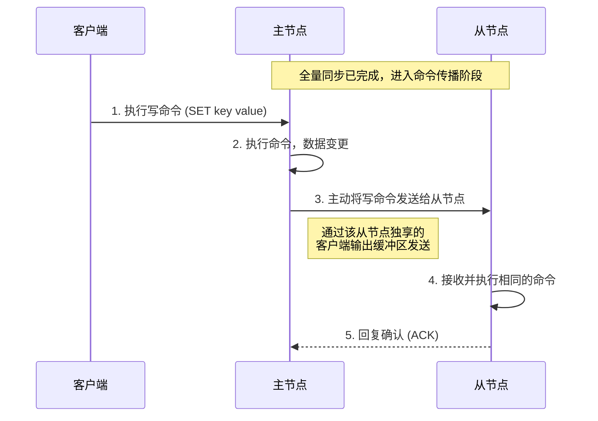

单点 Redis 有数据丢失、并发能力、故障恢复、存储能力等问题。因此，需要部署 Redis 集群来解决这些问题。

- 数据丢失：实现 Redis 数据持久化
- 并发能力：搭建主从集群，实现读写分离
- 故障恢复：利用 Redis 哨兵，实现健康检测和自动恢复
- 存储能力：搭建分片集群，利用插槽机制实现动态扩容

## Redis 持久化

### RDB 持久化

RDB (Redis Database Backupfile，Redis 数据备份文件) 也叫做 Redis 数据快照，简单来说就是把内存中的所有数据都记录到磁盘中。当 Redis 实例故障重启后，从磁盘读取快照文件，恢复数据。快照文件称为 RDB 文件，默认是保存在当前运行目录。

在 Redis CLI 中执行 `SAVE` 命令，即可保存当前 RDB。但是这是在 Redis 进程的单线程中执行的，会阻塞所有命令。所以这种方式只适合 Redis 进程即将停机时使用。实际上，Redis 停机时会自动保存一次 RDB。

推荐使用 `BGSAVE` 命令，开启 Redis 子进程在后台异步保存 RDB，主进程不受影响。这种方式适合在 Redis 正常运行时使用。

```conf {filename=redis.conf}
# save 900 1 # 900秒内至少有1个key修改，则执行bgsave
# save 300 10
# save 60 10000
# save "" # 禁用RDB
```

太快会写不过来，太慢会增加数据丢失风险。一般设置成 30 秒或 60 秒 save 一次就行了。然而，只是这样，宕机时仍会丢失这一小段时间写入的数据，这需要配合后面的措施解决。

```conf {filename=redis.conf}
rdbcompression yes #是否压缩rdb，建议不开启，磁盘比CPU便宜
dbfilename dump.rdb #rdb文件名
dir ./ #持久化文件存放目录，现在是运行目录
```

#### fork 的原理

`BGSAVE` 开始时会 fork 主进程得到子进程，子进程共享主进程的内存数据。完成 fork 后，由子进程读取共享内存数据并写入 RDB 文件，用新的 RDB 替换旧的 RDB。fork 的过程主进程是阻塞的，所以 fork 必须要快，怎么做到？

在 Linux 中所有的进程都不能直接操作物理内存，而是由操作系统给每个进程分配一个虚拟内存，并维护一个虚拟内存到物理内存的映射关系表，这个表叫做 “页表”。

主进程 fork 时，只需要拷贝它的页表到子进程，因为映射关系一样，所以它和主进程共用一块物理内存。这样就无需拷贝物理内存的数据，直接通过拷贝引用实现了内存共享。

然而，子进程读取的时候主进程也可以修改内存，读写可能冲突，导致数据不一致。为解决这个问题，fork 采用写时复制 (copy-on-write) 技术：

- fork 会标记共享内存是只读的。
- 主进程在读取时，访问共享内存。
- 主进程在写入时，拷贝一份数据，再在拷贝的数据上写入，且以后的读写操作都在拷贝的数据上执行了。

然而，极端情况下，子进程备份耗时较久，在这个过程中不断有新数据涌入，结果所有的数据都修改了一遍，意味着 Redis 的内存翻倍了。这会导致给 Redis 分配的内存不够它用，所以我们会预留一些内存给写时复制使用。

### AOF 持久化

AOF 全称为 Append OnlyFile (追加文件)。Redis 处理的每一个写命令都会记录在 AOF 文件，可以看做是命令日志文件。AOF 默认是关闭的，需要修改 redis.conf 配置文件来开启 AOF：

```conf
#是否开启AOF功能，默认是no
appendonly yes
#AOF文件的名称
appendfilename "appendonly.aof"
```
 
AOF 的命令记录的频率也可以通过 redis.conf 文件来配：

```conf
# 表示每执行一次写命令，立即记录到 AOF 文件
# 性能最差，安全性好
# appendfsync always
# 写完先放入 AOF 缓冲区，然后表示每隔 1 秒将缓冲区数据写到 AOF 文件
# 性能中等，最多丢失 1 秒数据，默认方案
appendfsync everysec
# 写完先放入 AOF 缓冲区，由操作系统决定何时将缓冲区内容写回磁盘
# 性能最好，安全性差
# appendfsync no
```

因为是记录命令，AOF 文件会 RDB 文件大的多。且 AOF 会记录对同个 key 的多次写操作，但只有最后次写操作才有意义。通过执行 `bgrewriteaof` 命令，可以让 AOF 文件执行重写功能，这会压缩 AOF 文件，用最少的命令达到相同效果。

Redis 也会在触发阈值时自动去重写 AOF 文件。阈值也可以在 redis.conf 中配置：

```conf
# AOF 文件比上次文件增长超过多少百分比则触发重写
auto-aof-rewrite-percentage 100
# AOF 文件体积最小多大以上才触发重写
auto-aof-rewrite-min-size 64mb
```

### 总结：比较两种持久化方式

RDB 和 AOF 各有自己的优缺点，如果对数据安全性要求较高，在实际开发中往往会结合两者来使用。Redis 启动时优先加载 AOF 文件，因为它比 RDB 文件数据更完整。

| 比较维度           | RDB                                          | AOF                                                            |
| ------------------ | -------------------------------------------- | -------------------------------------------------------------- |
| **持久化方式**     | 定时对整个内存做快照                         | 记录每一次执行的命令                                           |
| **数据完整性**     | 不完整，两次备份之间会丢失                   | 相对完整，取决于刷盘策略                                       |
| **文件大小**       | 会有压缩，文件体积小                         | 记录命令，文件体积很大                                         |
| **宕机恢复速度**   | 很快                                         | 慢                                                             |
| **数据恢复优先级** | 低，因为数据完整性不如 AOF                   | 高，因为数据完整性更高                                         |
| **系统资源占用**   | 高，大量 CPU 和内存消耗                      | 低，主要是磁盘 IO 资源；但 AOF 重写时会占用大量 CPU 和内存资源 |
| **使用场景**       | 可以容忍数分钟的数据丢失，追求更快的启动速度 | 对数据安全性要求较高常见                                       |

## Redis 主从集群

单节点 Redis 的并发能力是有上限的，要进一步提 Redis 的并发能力，就需要搭建主从集群，实现读写分离。Redis 面对的场景一般都是读多写少，所以可以采用读写分离，从节点读，主节点写。一主多从，多个从节点共同承担读取压力，从而提高读取并发能力。从节点是只读的。

### 搭建主从集群

最简单的主从架构是一主两从。我的配置如下：

文件结构：

```
/tmp/7001/redis.conf
/tmp/7002/redis.conf
/tmp/7003/redis.conf
```

redis.conf 需要修改的配置：

```
bind 127.0.0.1 ::1
port 7001
daemonize no
pidfile redis.pid
logfile ""
dir /tmp/7001/
replica-announce-ip 127.0.0.1
replica-announce-port 7001
```

最后两项 `replica` 打头的配置是宣告 IP 和端口，用于对外宣告我的实际地址。这是为了防止在复杂的网络环境下，如虚拟机、Docker、NAT 转发或云服务器环境下，Redis 实例会不小心抓取到虚拟网卡的地址，这是内部私有地址，外部节点无法访问，导致主从之间连不上。

然后配置主从：我配置 7002 和 7003 为 7001 的从节点

```
replicaof 127.0.0.1 7001
```

最后把它们都启动起来：

```
redis-server /tmp/7001/redis.conf
redis-server /tmp/7002/redis.conf
redis-server /tmp/7003/redis.conf
```

测试主从同步：

```
❯ redis-cli -p 7001
127.0.0.1:7001> set num 123
OK
127.0.0.1:7001> get num
"123"
127.0.0.1:7001> exit
❯ redis-cli -p 7002
127.0.0.1:7002> get num
"123"
127.0.0.1:7002> exit
❯ redis-cli -p 7003
127.0.0.1:7003> get num
"123"
127.0.0.1:7003> exit
```

### 全量同步

主从集群第一次同步是全量同步，分为三个阶段：请求同步、通过 RDB 同步和同步 RDB 同步期间积压的命令。


关于第三阶段的勘误在本文的[这里](#全量同步的第三阶段)。

#### 全量同步的第一阶段 请求同步

- replication id：replid，是数据集的标记，id 一致则说明是同一数据集。每一个 master 都有唯一的 replid，replica 则会继承 master 节点的 replid。
- offset：偏移量，随着记录在 `repl_backlog` 中的数据增多逐渐增大。replica 完成同步时，也会记录当前同步的 offset。如果 replica 的 offset 小于 master 的 offset，说明 replica 的数据落后于 master，需要更新。

从节点 replica 做数据同步时，必须向主节点 master 声明自己的 replid 和 offset，master 才可以判断你是不是我的从节点，以及到底需要同步哪些数据。

> [!note] 何时做全量同步？
>
> 我主节点怎么知道从节点是不是第一次连接，以便我知道要不要给它做全量同步？换句话说，replid 和 offset 哪个能分辨出陌生的从节点？通过 replid 来分辨。
>
> replid 是数据集的指纹，即使 offset 相同，只要数据集指纹 replid 不同，也不是我主节点的从节点。一个健康的主从集群中，主节点和它所有的从节点手里的 replid 都应该是一样的。
>
> offset 不能唯一标识从节点，如果它跟另一个主节点同步了 100 offset，而另一个从节点则跟这个主节点同步了 100 offset，那么这两个从节点单凭 offset 就无法区分是谁的随从了。

因此，全量同步第一阶段的详情是：

1. 从节点请求增量同步：`PSYNC replid offset`
2. 主节点判断请求 replid 是否跟自己的一致
3. 发现不一致，则从节点是第一次同步，主节点返回自己的 replid 和 offset，即数据版本信息，然后开始全量同步


#### 全量同步的第三阶段 同步积压

主节点 `BGSAVE` 之后，会直接进入正常连接状态，通过命令传播给从节点同步发送命令。从节点在加载完收到的 RDB 后，就会从这个缓冲区拿取并执行这期间积压的命令，最终达到数据一致。

> [!warning] 勘误：全量同步的第三阶段用的并不是 repl_backlog，而是“客户端输出缓冲区”
>
> 主节点会专门为每个从节点连接开辟一个客户端输出缓冲区，用于正常连接时的[命令传播](#命令传播)。在全量同步的第三阶段，主节点产生的写命令会同时写入 `repl_backlog` 和该从节点的客户端输出缓冲区，但从节点最终是从客户端输出缓冲区中获取并执行这些命令，而不是从 `repl_backlog` 中读取。

如果全量同步期间写命令积压太多，超过 `client-output-buffer-limit` 的限制，主节点会主动断开与从节点的连接，导致全量同步失败。

### 命令传播

命令传播是主从节点正常连接、实时同步数据的阶段。此时，主节点每执行一个写命令，会主动推送给所有在线的从节点。主节点会专门为每个从节点连接开辟一个**客户端输出缓冲区**（client output buffer），命令传播就是在这个缓冲区上实现的。



### 增量同步

如果从节点断线重连，那么它会向主节点请求增量同步，主节点看它的 replid 跟自己一样，知道它不是第一次同步，于是把它的 offset 跟自己的比对一下，只同步那些相差的部分，这就是增量同步。

增量同步基于**复制积压缓冲区**（replication backlog），这是主节点在内存维护的一个环形缓冲区（circular buffer），本质是一个数组。无论何时，只要主节点在写数据，就会把这些命令同步写入这个缓冲区。当它写满时，最新的命令会覆盖最旧的命令。可通过 `repl-backlog-size` 配置它的大小，默认 1 MiB。


当从节点请求增量同步时，主节点会看它的 offset 在 `repl_backlog` 里面是否还在，如果还没被更新的命令覆盖，就把更新的命令同步到从节点；如果主节点写得太快导致直接把从节点套圈了，那么套出来的那些命令在 `repl_backlog` 就再也找不到了，主节点只好再发起一次全量同步。因此，增量同步时触发全量同步的阈值是 `repl-backlog-size`。

> [!note] repl_backlog 只用于增量同步，正常连接时的同步使用命令传播机制
>
> 如果全量同步之后从节点不重启不宕机，那么后续的同步使用的是主节点为该从节点连接的客户端输出缓冲区，借助[命令传播](#命令传播)机制实现的，而 `repl_backlog` 在此阶段并不直接参与传输，而是作为“备份”默默积累。直到从节点断线重连请求增量同步时，才会启用 `repl_backlog`。

### 主从同步的优化

提高全量同步的性能：

- 在 master 中配置 `repl-diskless-sync yes` 启用无磁盘复制，避免全量同步的磁盘 IO。适合磁盘慢网络快的场景。
- Redis 单节点的内存上限不要太大，减少 RDB 体积，避免过多磁盘 IO。
 
减少全量同步的次数：

- 适当提高 `repl_baklog` 的大小，发现 replica 宕机时尽快实现故障恢复，尽可能避免全量同步。

减少主节点压力：

- 限制一个 master 上的 replica 数量，如果实在太多 replica，则可以采用主-从-从链式结构，减少 master 压力。在配置 `replicaof` 时，让后面的 replica 直接认前面的 replica 为 master 即可。

## Redis 哨兵

从节点宕机有增量同步，主节点宕机怎么办？如果主节点宕机，就会导致客户端无法写入，而从节点是只读的，怎么办？Redis 提供了哨兵（sentinel）机制来实现主从集群的故障转移（failover）。哨兵的结构和作用如下：

- 监控：sentinel 会不断检查 master 和 replica 是否按预期工作。
- 故障转移：如果 master 故障，哨兵会选一个 replica 提升为 master 顶上。当故障实例恢复后，也以新的 master 为主。
- 通知：sentinel 充当 Redis 客户端的服务发现源，当集群发生故障转移时，会将最新信息推送到 Redis 客户端

Redis 的 Java 客户端 RedisClient 先要通过 sentinel 知道主从的地址，才能连接并配置主从。

### 哨兵的服务状态监控

Sentinel 基于心跳机制检测服务状态，每隔 1 秒向集群的每个实例发送 ping 命令：

- 主观下线：如果某个 sentinel 节点发现一个实例未在规定时间响应，则认为该实例主观下线。
- 客观下线：若超过指定个数（quorum）的 sentinel 都认为实例主观下线，则该实例客观下线。Quorum 值最好超过 sentinel 实例个数的一半。

主观下线是初步判断为下线，客观下线才是真的认定为下线。

### 哨兵选举新的主节点

一旦发生 master 故障，sentinel 需要在 replica 中选出一个作为新的 master，选择依据是：

1. 排除不同步的：判断 replica 与 master 断开的时间长短，会排除断开时间超过指定值（`down-after-milliseconds` * 10）的
2. 排除不优先的：判断 replica 的 `replica-priority` 值大小，越小优先级越高，0 是不参与选举，会排除优先级低的
3. 排除数据旧的：如果优先级一样，则判断 offset 值大小，越小数据越旧，会排除旧的
4. 选一个顺眼的：如果经过前面的筛选，还有超过一个 replica 留了下来，则判断 replica 的运行 id 大小，会选择最小的那一个

### 哨兵实现故障转移

当哨兵选中其中一个 replica 为新的 master 时，故障转移的步骤为：

1. sentinel 给选中的 replica 发送 `replicaof no one` 命令，让它成为 master
2. sentinel 给其他所有 replica 发送 `replicaof <newMasterIP> <port>` 命令，让它们成为新的 master 的从节点，从新的 master 同步数据
3. sentinel 会将故障节点标记为 replica，并重写它的配置文件，使它恢复时会自动成为新的 master 的 replica

不止第 3 步，哨兵每次调度节点时都会伴随 `CONFIG REWRITE` 命令重写节点的配置文件，保证集群在配置上也转移的新的 master，将当前集群状态持久化到硬盘上，避免主从集群内部信息不一致问题。

哨兵自身也有持久化，它们有“配置纪元”（configuration epoch）的概念，每次故障转移 epoch 都会加一，哨兵会把 epoch 和新 master 记录在自己的配置文件中。当哨兵重启时，会通过 gossip 协议通信，找出 epoch 最高的配置作为基准配置，避免哨兵集群内部信息不一致的问题。

### 哨兵配置文件实战

新建 `sentinel.conf` 文件并写入：

```conf
port 27001
sentinel announce-ip 127.0.0.1
sentinel monitor mymaster 127.0.0.1 7001 2
sentinel down-after-milliseconds mymaster 5000
sentinel failover-timeout mymaster 60000
dir /tmp/s1
```
- `announce-ip` 对外宣告 sentinel 的 IP
- `monitor mymaster 127.0.0.1 7001 2` sentinel 监控的集群名（master 名）和 master 地址，`2` 判断客观下线的 quorum 值
- `down-after-milliseconds` replica 与 master 断开的超时时长
- `failover-timeout` 故障恢复的超时时长

### 哨兵故障转移核心操作速查表

| 阶段         | 日志关键词                           | 说明                                                           |
| :----------- | :----------------------------------- | :------------------------------------------------------------- |
| **判定阶段** | `+sdown`                             | **主观下线 (Subjective Down)**：当前哨兵认为主节点失联。       |
|              | `+odown`                             | **客观下线 (Objective Down)**：足够数量的哨兵确认主节点失联。  |
| **选举阶段** | `+new-epoch`                         | **新纪元**：故障转移计数器加 1，确保配置版本唯一。             |
|              | `+try-failover`                      | **发起转移**：哨兵开始进入故障转移流程。                       |
|              | `+vote-for-leader`                   | **投票**：哨兵之间投票选出执行转移任务的“领头哨兵”。           |
|              | `+elected-leader`                    | **选出领头**：选举结束，确定了负责执行的具体哨兵。             |
| **晋升阶段** | `+failover-state-select-slave`       | **筛选从库**：在剩余从节点中寻找最适合晋升的节点。             |
|              | `+selected-slave`                    | **确定目标**：选定了一个具体的从节点作为新主节点。             |
|              | `+failover-state-send-slaveof-noone` | **解绑指令**：向目标从节点发送指令，让其停止同步，变为主节点。 |
|              | `+promoted-slave`                    | **晋升成功**：确认目标从节点已成功转型为新主节点。             |
| **重构阶段** | `+failover-state-reconf-slaves`      | **同步重配**：开始通知其他从节点去同步新的主节点。             |
|              | `+slave-reconf-sent`                 | **发送配置**：已向其他从节点发送了 `SLAVEOF` 变更指令。        |
|              | `+slave-reconf-done`                 | **配置完成**：其他从节点已完成对新主节点的同步关联。           |
| **收尾阶段** | `+failover-end`                      | **流程结束**：故障转移的所有逻辑步骤执行完毕。                 |
|              | `+switch-master`                     | **正式切换**：哨兵更新内部映射，正式宣布新主节点地址。         |

如果你不知道主节点换到哪儿了，找 sentinel 故障转移日志中 `+switch-master` 打头的行，可以看最终切换到哪个节点。

### RedisTemplate 的哨兵模式

```
Spring的RedisTemplate如何感知哨兵的故障转移？

具体在spring项目中如何引入？引入依赖；修改yml配置；配置主从读写分离，并介绍readFrom方法和它的读取策略参数，即每个枚举项的含义

怎么看这个场景下的spring日志？分别解释get、set和故障转移时的日志，先用代码块给出日志示例，然后解释关键字
```

在生产环境下，为了保证 Redis 的高可用性，哨兵（Sentinel）模式是常见的选择。当主节点（Master）发生宕机、故障转移（Failover）时，基于 Spring Data Redis 的应用是如何在不重启服务的情况下，自动感知到新主节点并完成连接切换的？

其实，底层驱动（如 Lettuce）会通过监听哨兵提供的 Pub/Sub 频道（如 `+switch-master`）来获取拓扑结构的变更。当哨兵集群选举出新的 Master 后，会广播该消息，Lettuce 接收到通知后会立即刷新内部的连接池状态。这种机制保证了客户端对后端架构变化的感知是毫秒级的。

#### 依赖引入与基础配置

要在 Spring Boot 项目中使用哨兵模式，首先需要确保 `spring-boot-starter-data-redis` 依赖已就位。由于目前 Spring Boot 默认使用 Lettuce 作为连接驱动，其对哨兵模式的支持非常完善，无需额外引入底层驱动包。

在 `application.yml` 中，配置逻辑从单一的 `host/port` 转向了 `sentinel` 节点组。你需要指定哨兵集群的地址以及 Master 的逻辑名称（对应 `redis.conf` 中的 `sentinel monitor <master-name>`）：

```yaml
spring:
  redis:
    # 必须匹配哨兵配置文件中的主节点名称
    sentinel:
      master: mymaster 
      nodes:
        - 192.168.1.101:26379
        - 192.168.1.102:26379
        - 192.168.1.103:26379
    password: your_password
    lettuce:
      pool:
        max-active: 32
        max-wait: 300ms
```

**注意陷阱**：在配置 `nodes` 时，务必填写哨兵端口（默认 26379）而非 Redis 节点端口（默认 6379）。如果哨兵部署在 Docker 容器内，需确保 `sentinel announce-ip` 正确配置，否则客户端可能会获取到容器内部的私有 IP 导致连接失败。

#### 配置主从读写分离

哨兵模式下如果不做特殊配置，所有的请求（包括读）都会打到 Master 上，这显然浪费了 Slave 节点的性能。通过配置 `LettuceClientConfiguration`，我们可以实现读写分离。

我们可以通过定义一个 `RedisConnectionFactory` 的 Bean 来手动控制读取策略：

```java
@Configuration
public class RedisConfig {

    @Bean
    public LettuceClientConfigurationBuilderCustomizer clientConfigurationCustomizer() {
        // 核心：设置读取策略
        return clientConfigurationBuilder -> 
            clientConfigurationBuilder.readFrom(ReadFrom.REPLICA_PREFERRED);
    }
}
```

`ReadFrom` 提供了多种策略来适应不同的业务场景：

| 策略枚举项          | 含义与适用场景                                                      |
| :------------------ | :------------------------------------------------------------------ |
| `MASTER`            | 默认值。只从 Master 读取，一致性最高，但 Master 压力大。            |
| `MASTER_PREFERRED`  | 优先读 Master，若 Master 不可用则读 Replica。                       |
| `REPLICA`           | 只从从节点（Replica）读取，适合对实时性要求不高的分析类业务。       |
| `REPLICA_PREFERRED` | **最推荐**。优先从 Replica 读取，若 Replica 全部挂掉再回到 Master。 |
| `NEAREST`           | 根据延迟选择最近的节点，适合跨机房部署。                            |

#### 故障转移的日志表现

通过日志观察 RedisTemplate 的行为是排查高可用问题的最直接手段。建议将 `org.springframework.data.redis` 和 `io.lettuce.core` 的日志级别设为 `DEBUG`。

##### 正常读写时的日志

当你执行一个 `opsForValue().get("key")` 时，如果配置了 `REPLICA_PREFERRED`，你会看到类似下方的记录：

```text
DEBUG i.l.core.protocol.DefaultEndpoint - [192.168.1.101:26379] Write to connection for GET
DEBUG i.l.core.MasterSlaveConnectionProvider - Selected connection [192.168.1.103:6379] for ReadFrom REPLICA_PREFERRED
```

这证明了 Lettuce 正在根据你的策略动态寻找 Replica 节点进行分流。

##### 故障转移时的日志

当 Master (192.168.1.101) 宕机，哨兵开始故障转移时，日志会经历从报错到重连的过程：

```text
WARN  i.l.core.protocol.ConnectionWatchdog - [192.168.1.101:6379] Reconnecting, attempt 1...
INFO  i.l.core.masterslave.SentinelTopologyRefresh - Master has changed from 192.168.1.101:6379 to 192.168.1.102:6379
DEBUG i.l.core.protocol.DefaultEndpoint - Re-binding connection to new Master: 192.168.1.102:6379
```

* **Reconnecting**：由于原本的连接断开，Lettuce 的看门狗（Watchdog）尝试重连。
* **SentinelTopologyRefresh**：这是最关键的信号，表示驱动收到了哨兵的拓扑更新通知。
* **Master has changed**：明确指示了主节点 IP 的漂移方向。此时，旧的写入请求可能会短暂报错（如 `Command timed out`），但随着 `Re-binding` 完成，应用会自动恢复正常，无需任何人工干预。

## Redis 分片集群

```
## Redis 分片集群
### 分片集群结构
首先明确集群中有三个master分别是7001、7002和7003；它们各有一个replica分别是8001、8002和8003；
主从哨兵可以解决……，不能解决……，对此可以用分片集群；
分片集群特征如下，因此可以解决包含主从哨兵能解决的在内的所有问题；
### 搭建分片集群
一段话概括搭建流程，下附流程中用到的所有命令的代码块；
介绍redis-cli --cluster常用操作，简要介绍即可，列个速查表，后面还会穿插着详细介绍每个操作；
我遇到的问题(error) CLUSTERDOWN Hash slot not served，可能的原因，解决方案https://cloud.tencent.com/developer/article/1919678；
### 散列插槽
什么是散列插槽，key与插槽绑定的机制，两种情况：key中含与不含{}，插槽计算方式，用的算法；
为什么数据绑定插槽，有什么用；
展示redis-cli计算插槽和-c的重定向功能，因此访问任意node都没差，反正会重定向；
总结：redis如何判断key在哪个实例？如何将同一类数据固定存在同一实例中？`{typeId}:key`；
### 集群伸缩
介绍redis-cli --cluster add-node详细用法；
案例：向集群添加一个新master为7004，并在其中存num=123；难点是怎么把num的插槽分配到7004，经前期测试，num的插槽原本是2765，在7001（介绍redis-cli --cluster reshard重新分片，把7001的前3000个插槽移动到7004）；给出每个阶段cluster nodes的模拟结果；
案例：删除7004（先转移所有插槽，然后del-node）；
### 故障转移
思考：当集群中一个master宕机会发生什么：首先是失去连接，然后是疑似宕机，最后是确定下线，自动故障转移；但有时需要手动故障转移，比如升级老旧设备；
案例：让7002宕机并重启，观察集群情况；结果7002变成slave，8002变成master；
数据迁移：介绍cluster failover如何实现无感数据迁移；用mermaid画序列图（参考我提供的图1）；failover的参数，缺省，force，takeover；案例：通过failover让7002从8002夺回master地位（为什么刚好夺的是8002？）；
### RedisTemplate访问分片集群
基于lettuce对分片集群的支持；使用步骤：引入依赖；配置分片集群地址；配置读写分离；与哨兵相比只有cluster部分的差异；
```

主从哨兵解决了单点故障和读高并发，但解决不了单节点内存瓶颈和写压力——所有数据还在一个 master 上。分片集群把数据拆成多份，每个 master 存一部分，同时每个 master 还可以挂 replica，所以主从哨兵能解决的问题它都能解决，此外还有：

- 数据自动分散到多个节点，突破单机内存限制
- 写请求也可以分摊，提高写入吞吐
- 线性扩展能力：加节点就扩容

### 搭建分片集群

先明确一下环境：三个 master 节点，端口分别是 7001、7002、7003；每个 master 配一个 replica，端口 8001、8002、8003。

搭建分片集群其实就是启动多个 Redis 实例，然后用 `redis-cli --cluster` 命令把它们揉在一起。大致流程：先准备好 6 份不同的配置文件（端口、dir、cluster-enabled yes 等），分别启动；再用 `redis-cli --cluster create` 指定所有节点地址，并分配主从关系。

下面是具体命令（假设所有配置文件都已就绪）：

```bash
# 启动 6 个实例
redis-server ./conf/7001.conf
redis-server ./conf/7002.conf
redis-server ./conf/7003.conf
redis-server ./conf/8001.conf
redis-server ./conf/8002.conf
redis-server ./conf/8003.conf

# 创建集群，3 个 master 3 个 slave，--cluster-replicas 1 表示每个 master 带一个 slave
redis-cli --cluster create 127.0.0.1:7001 127.0.0.1:7002 127.0.0.1:7003 \
  127.0.0.1:8001 127.0.0.1:8002 127.0.0.1:8003 \
  --cluster-replicas 1
```

`redis-cli --cluster` 的常用操作我整理了个速查表：

| 命令        | 作用                 |
| ----------- | -------------------- |
| `create`    | 创建集群             |
| `add-node`  | 添加新节点           |
| `del-node`  | 删除节点             |
| `reshard`   | 重新分片（移动插槽） |
| `check`     | 检查集群状态         |
| `info`      | 查看集群信息         |
| `rebalance` | 自动平衡插槽分布     |

**踩坑记录**：有次我启动集群后报 `(error) CLUSTERDOWN Hash slot not served`。原因是部分插槽没有对应的 master 提供服务，比如创建集群时某些节点没起来，或者 reshard 过程中中断了。解决方案参考了[这篇文章](https://cloud.tencent.com/developer/article/1919678)，本质是找到未覆盖的插槽范围，用 `redis-cli --cluster fix` 修复，或者手动 `cluster addslots` 分配。

### 散列插槽

Redis 分片集群的核心是 **16384 个散列插槽**。每个 key 属于某个插槽，每个 master 负责一段插槽区间。

**插槽计算规则**：
- 如果 key 包含 `{}`，只对 `{}` 里面的内容计算 CRC16。例如 `user:{10086}:name` 和 `user:{10086}:age` 会落到同一个插槽。
- 否则对整个 key 计算。

算法就是 `CRC16(key) % 16384`。为什么绑定插槽？因为集群要快速知道某个 key 该去哪个节点，不需要维护全量 key 的映射，只需节点知道自己负责哪些插槽。

用 `redis-cli` 可以手动计算插槽号：

```bash
# 计算 key 的插槽（未开启集群模式也能用）
redis-cli -p 7001 cluster keyslot user:10086

# 带上 -c 参数自动重定向
redis-cli -c -p 7001
> set user:10086 "hello"
-> Redirected to slot [xxx] located at 127.0.0.1:7002
OK
```

因为自动重定向，客户端访问任意节点都能得到正确结果。

**总结**：Redis 判断 key 在哪个实例，是先算插槽，再找负责该插槽的 master。要想把同一类数据固定在一个实例，就用 `{固定前缀}:具体key` 的格式。

### 集群伸缩

添加节点用 `add-node`，语法：

```bash
redis-cli --cluster add-node 新节点地址 集群中任意旧节点地址
```

**案例：给集群加一个新 master 7004**

```bash
# 1. 启动 7004 实例
redis-server ./conf/7004.conf

# 2. 加入集群（不加 --cluster-slave 就是加为 master）
redis-cli --cluster add-node 127.0.0.1:7004 127.0.0.1:7001
```

此时 `cluster nodes` 能看到 7004 是 master，但负责的插槽数为 0。我要存一个 `num=123`，算一下它的插槽：

```bash
redis-cli cluster keyslot num   # 假设结果是 2765
```

这个插槽原本在 7001 上。所以需要把 7001 的部分插槽移动到 7004。

```bash
# 重新分片，从 7001 移动前 3000 个插槽到 7004
redis-cli --cluster reshard 127.0.0.1:7001 \
  --cluster-from <7001-node-id> \
  --cluster-to <7004-node-id> \
  --cluster-slots 3000 \
  --cluster-yes
```

移动前后 `cluster nodes` 的变化：

- 移动前：7001 负责 [0-5460]，7004 负责 无
- 移动后：7001 负责 [3000-5460]，7004 负责 [0-2999]

删除节点同理，先把它负责的插槽全部转移到其他 master，再 `del-node`：

```bash
# 先把 7004 的所有插槽转移回 7001（或均分）
redis-cli --cluster reshard 127.0.0.1:7001 \
  --cluster-from <7004-id> \
  --cluster-to <7001-id> \
  --cluster-slots 3000 \
  --cluster-yes

# 删除空节点
redis-cli --cluster del-node 127.0.0.1:7001 <7004-id>
```

### 故障转移

集群中一个 master 宕机会发生什么？首先其他节点发现它 PING 超时，标记为 PFAIL（疑似宕机）；当超过半数 master 确认后，变成 FAIL（确定下线），然后它的 slave 发起选举，提升为 master。

**案例：让 7002 宕机并重启**

```bash
# 杀掉 7002 进程
kill -9 <pid-of-7002>

# 等待几秒，观察集群
redis-cli -p 7001 cluster nodes
# 会发现 8002 变成了 master，7002 显示 fail

# 重启 7002
redis-server ./conf/7002.conf
# 再观察，7002 变成 8002 的 slave
```

自动故障转移对客户端有短暂影响，因为需要重新选举。如果要做**无感数据迁移**（比如升级老旧设备），可以用 `cluster failover` 命令，让 slave 主动和 master 完成数据同步后切换，客户端几乎感知不到。

下面是手动故障转移的时序图：


`cluster failover` 有三种参数：
- 缺省：等待 master 同步完 offset 再切换（推荐，无感）
- `force`：不等待直接切换，可能丢数据
- `takeover`：极端情况，直接强行接管，用于 master 已挂且没有正常 slave 时

**案例：让 7002 从 8002 夺回 master 地位**

因为 7002 重启后是 8002 的 slave，我想让它重新变成 master。连接到 7002 执行：

```bash
redis-cli -p 7002
> cluster failover
```

为什么夺回的是 8002？因为 7002 当前就是从属于 8002，failover 的对象就是自己的 master。

### RedisTemplate 访问分片集群

Spring Boot 中基于 Lettuce 访问分片集群很简单。和哨兵模式相比，只是 `cluster` 部分的配置不一样，读写分离需要额外开启。

**步骤**：

1. 引入依赖（spring-boot-starter-data-redis 已经包含 lettuce）
2. 配置分片集群地址
3. 开启读写分离（可选）

**配置示例**（application.yml）：

```yaml
spring:
  redis:
    cluster:
      nodes:
        - 127.0.0.1:7001
        - 127.0.0.1:7002
        - 127.0.0.1:7003
        - 127.0.0.1:8001
        - 127.0.0.1:8002
        - 127.0.0.1:8003
```

实际代码中，如果想让读请求优先走 slave，需要自定义 `LettuceClientConfiguration`：

```java
@Bean
public LettuceConnectionFactory redisConnectionFactory() {
    return new clientConfigurationBuilder ->
            clientConfigurationBuilder.readFrom(ReadFrom.REPLICA_PREFERRED);
}
```

和哨兵模式的区别就这一点：哨兵配置 `sentinel` 节点，集群配置 `cluster` 节点。其他像 `RedisTemplate` 的序列化、`@Cacheable` 等用法完全一样。
